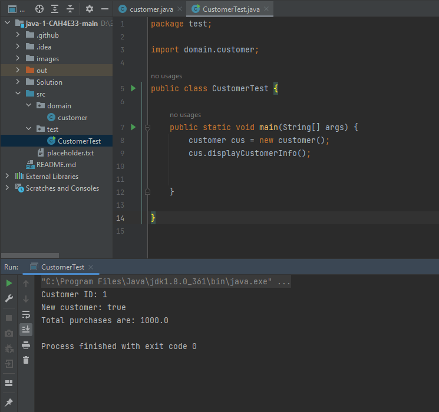

## Завдання 1. Створення класу з атрибутами

``` java
public class customer {
    
    private int ID;
    private boolean isNew;
    private float total;
    
    public customer() {
        ID = 1;
        isNew = true;
        total = 1000;
    }

}
```
## Завдання 2. Додавання в клас методів 

Додати до класу метод ````displayCustomerInfo````, який виводить на консоль інформацію про клієнта з допомогою ````System.out.println````. Кожен рядок має містити відповідну мітку, наприклад, "Total purchases are:" (див. перердню роботу).
``` java
public void displayCustomerInfo() {
        System.out.println("Customer ID: " + ID);
        System.out.println("New customer: " + isNew);
        System.out.println("Total purchases are: " + total);

    }
```
## Перевірка працездатності створеного класу

1. Створити в **пакеті ````test````** клас ````CustomerTest````, в методі ````main```` якого створити об'єкт класу ```` Сustomer ```` та вивести на екран його властивості з допомогою методу ````displayCustomerInfo```` (див. відеозапис лекції). 
2. **запустіть** його (<kbd>F6</kbd> у NetBeans для запуску головного виконуваного файлу, <kbd>SHIFT</kbd>+<kbd>F6</kbd> - для запуску поточного файлу)
3. зробіть та збережіть (тека **Solution**) у файл ````done.png```` **скріншот** результатів роботи програми 




✅ додати **конструктор за замовчуванням**, який ініціалізує атрибути початковими значеннями (див. відеозапис лекції) 
``` java  
 public customer() {
        ID = 1;
        isNew = true;
        total = 1000;
    }
```
✅ додати **методи для зміни атрибутів** - ````setID````, ````setStatus````, ````setTotal```` з відповідними параметрами та перевіркою присвоюваних значень (можуть або нічого не повертати, або повертати булевське значення, див. відеозапис лекції). 
``` java
public void setID(int ID) {
        if (ID > 0) {
            this.ID = ID;
        }

    }
    
public void setNew(boolean isNew) {
        this.isNew = isNew;

    }
    
public void setTotal(float total) {
        if (total > 0) {
            this.total = total;
        }

    }
```
✅ **використати ці методи** в методі в методі ````main```` класу````CustomerTest````
``` java
public static void main(String[] args) {
        customer cus = new customer();
        cus.displayCustomerInfo();
        cus.setTotal(-1.2F);
        cus.setNew(false);
        cus.setID(12);
        cus.displayCustomerInfo();


    }
```


